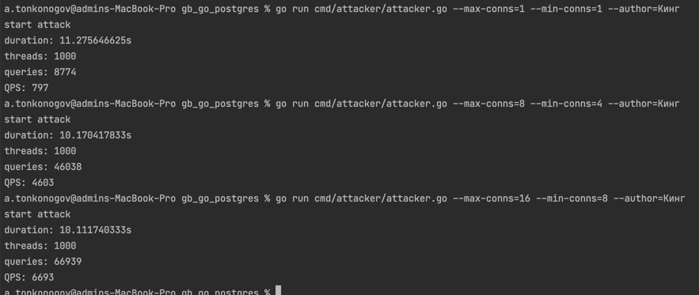

# gb_go_postgres Homework 4

## Как запустить 
Запускаем контейнер:

```bat
docker run \
    --rm -it \
    -p 5432:5432 \
    --name postgres \
    -e POSTGRES_PASSWORD=password \
    -e PGDATA=/var/lib/postgresql/data \
    postgres:13.1
```

В папке сmd лежит main.go, который можно собрать в консольное приложение. Приложение по фамилии автора находит в базе имеющиеся книги.
При первом запуске необходимо создать таблицы и наполнить их при помощи параметра init-db в значении true. 
При последующих необходимо передавать false или не передавать параметр совсем.

```console
go run cmd/main.go --author=Кинг --init-db=true
```

Пример:


В папке сmd/attacker простая реализация генератора нагрузки:

```console
go run cmd/attacker/attacker.go --max-conns=1 --min-conns=1 --author=Кинг
```

Пример:


